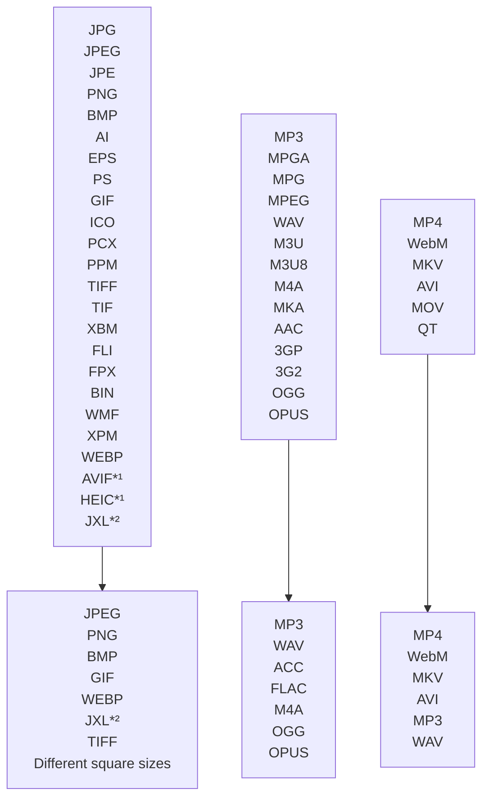

# linux-file-converter-addon

# Features
Convert between various image, audio and video formats using the context menu. The addon is written in Python and available for **Nautilus** and **Nemo** file viewers. It adds a new option to the context menu of the file viewer to create an easy way to convert between a huge amount of file types.
The program offers many options to customise the appearance of its context menu. There are also a few extra formats to convert with, which can be added by installing optional dependencies.
The tool has a built-in auto-update function to make sure the newest version is always provided.
Note that the Nemo port is very new and not as well tasted as the Nautilus version. If you experience any bugs, pleas report them on the [issue page](https://github.com/Lich-Corals/linux-file-converter-addon/issues/new/choose).

*¹ [Needs pyheif](https://github.com/Lich-Corals/linux-file-converter-addon/blob/main/markdown/install-dependencies.md#pyheif-heic-avif).
 *² [Needs jxlpy](https://github.com/Lich-Corals/linux-file-converter-addon/blob/main/markdown/install-dependencies.md#jxlpy-jxl).

# Installation
Please head over to the installation page for your file manager:
- [Nautilus](https://github.com/Lich-Corals/linux-file-converter-addon/blob/main/markdown/install-nautilus.md)
- [Nemo](https://github.com/Lich-Corals/linux-file-converter-addon/blob/main/markdown/install-nemo.md)

# Updating
If the script is installed in the home folder (~/.local/share/nautilus-python/extensions/) or has permissions to write in it's dictionary, it will update automatically as long as the automatic updates aren't disabled.

If automatic updates are disabled, you can run the installation commands again to update the program.
# Usage

Just right click on an supported file and choose the "Convert to..." option. In this sub menu you can select any file type you want to convert to.

Converting a file can take some time. There is no indicator when the process is done.

If you experience any issues with the extension, please report it on the [issues](https://github.com/Lich-Corals/linux-file-converter-addon/issues) page.

# Any questions?
If anything is not clear...
 If you have a problem...
 If you need a specific feature...
 If any of your files is not supported...
 <b>...feel free to open an [GitHub issue](https://github.com/Lich-Corals/linux-file-converter-addon/issues/new/choose)!</b>

# Credits
## Authors
- [Linus Tibert](https://github.com/Lich-Corals)

## Pull requests

- [derVedro](https://github.com/derVedro)
- [D10f](https://github.com/D10f)

#### All sections
- __[Main page](https://github.com/Lich-Corals/linux-file-converter-addon/blob/main/README.md)__
- [Configuration](https://github.com/Lich-Corals/linux-file-converter-addon/blob/main/markdown/configuration.md)
- [Errorrs and warnings](https://github.com/Lich-Corals/linux-file-converter-addon/blob/main/markdown/errors-and-warnings.md)
- [Install dependencies](https://github.com/Lich-Corals/linux-file-converter-addon/blob/main/markdown/install-dependencies.md)
- [Installation for Nautilus](https://github.com/Lich-Corals/linux-file-converter-addon/blob/main/markdown/install-nautilus.md)
- [Installation for Nemo](https://github.com/Lich-Corals/linux-file-converter-addon/blob/main/markdown/install-nemo.md)
