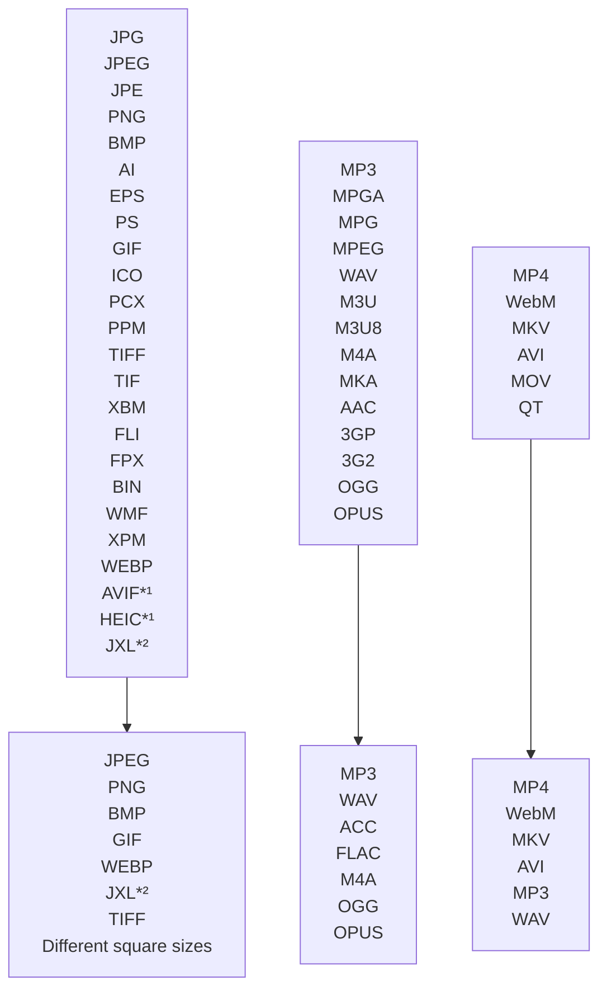

# linux-file-converter-addon
[](https://www.gnome-look.org/s/Gnome/p/1965601)


## 0. ReadMe Contents
1. [Features](#1-features)
2. [Installation](#2-installation)
   1. [Install dependencies](#21-dependencies)
   2. [Optional dependencies](#22-optional-dependencies)
   3. [Install the extension](#23-install-the-extension)
3. [Configuration](#3-configuration)
   1. [Automatic updates](#31-automatic-updates)
   2. [Shown menu items](#32-shown-menu-items)
   3. [Other options](#33-other-options)
4. [Updating](#4-updating)
5. [Usage](#5-usage)
6. [Warnings and errors](#6-warnings-and-errors)
7. [Any questions?](#7-any-questions)
8. [Credits](#8-credits)

# 1. Features
Convert between various image, audio and video formats using the context menu. The addon is written in Python and available for **Nautilus** and **Nemo** file viewers. It adds a new option to the context menu of the file viewer to create an easy way to convert between a huge amount of file types.
The program offers many options to customize the appearance of its context menu. There are also a few extra formats to convert with, which can be added by installing optional dependencies.
The tool has a built-in auto-update function to make sure the newest version is always provided.
Note that the Nemo port is very new and not as well tasted as the Nautilus version. If you experience any bugs, pleas report them on the [issue page](https://github.com/Lich-Corals/linux-file-converter-addon/issues/new/choose).

*¹ [Needs pyheif](#pyheif-heic-avif).
<br/>*² [Needs jxlpy](#jxlpy-jxl).
# 2. Installation
## 2.1 Dependencies
[pip](https://pypi.org/project/pip/) is a pre-dependency for pillow, it can be installed with the following commands:

```bash
Debian based distros:
sudo apt install python3-pip

Fedora based distros:
sudo dnf install python3-pip

Arch based distros:
pacman -S python-pip
```

[python-pillow](https://python-pillow.org/) is needed to convert images. It can be installed using pip:
```bash
pip install Pillow
```
###

[ffmpeg](https://ffmpeg.org/download.html#build-linux) is needed to convert audio and video.

```bash
Debian based distros:
sudo apt install ffmpeg

Fedora based distros:
sudo dnf install ffmpeg

Arch based distros:
sudo pacman -S ffmpeg
```

## Nautilus specific dependencies
GNOME's file viewer [Nautilus](https://apps.gnome.org/en-GB/app/org.gnome.Nautilus/) should be installed, otherwise it will be hard to install extension to it.

[nautilus-python](https://github.com/GNOME/nautilus-python) needs to be installed to install extensions:

```bash
Debian based distros:
sudo apt install python3-nautilus

Fedora based distros:
sudo dnf install nautilus-python

Arch based distros:
sudo pacman -Sy python-nautilus
```
## Nemo specific dependencies
[Nemo](https://github.com/linuxmint/nemo) needs to be installed.
```bash
Debian based distros:
sudo apt install nemo

Fedora based distros:
sudo dnf install nemo

Arch based distros:
sudo pacman -S nemo
```
## 2.2 Optional dependencies
### pyheif (HEIC, AVIF)
[pyheif](https://pypi.org/project/pyheif/) is needed if you want to convert from **heif** or **avif** format.
<br/> Install it using this command:
```bash
pip install pyheif
```
You may need to install some dependencies before installing pyheif. Otherwise you could get an error installing it.
```bash
yum install libffi libheif-devel libde265-devel
```
In addition, to convert *to* **avif** format you will need this [plugin for Pillow](https://pypi.org/project/pillow-avif-plugin/).
```bash
pip install pillow-avif-plugin
```

### jxlpy (JXL)
[jxlpy](https://github.com/olokelo/jxlpy) is needed if you want to convert from **jxl** format.
<br/> Install it using this command:
```bash
pip install jxlpy
```
Note: jxlpy is in a very early state, you may have issues while installing it using pip.
You may need to [install it manually](https://github.com/olokelo/jxlpy#build-it-yourself).

## 2.3 Install the extension
### Installation for Nautilus
- Download the nautilus-fileconverter.py file from the [release page](https://github.com/Lich-Corals/linux-file-converter-addon/releases).
    - Git users can also get the repository with these commands[:](https://bit.ly/3BlS71b)
        ```bash
        git clone https://github.com/Lich-Corals/linux-file-converter-addon

        cd ./linux-file-converter-addon
        ```
- For a system-wide installation move the file to '/usr/share/nautilus-python/extensions/' using this command in the dictonary with the file:
    ```bash
    sudo mv nautilus-fileconverter.py /usr/share/nautilus-python/extensions/nautilus-fileconverter.py
    ```
  - For a user specific installation move the file to '~/.local/share/nautilus-python/extensions/' using this command in the dictonary with the file:
      ```bash
      mv nautilus-fileconverter.py ~/.local/share/nautilus-python/extensions/nautilus-fileconverter.py
      ```
- Now you only have to restart Nautilus using the following commands:
    ```bash
   #Quit Nautilus
   nautilus -q

   #start it again, you can also use the normal launcher.
   nohup nautilus & disown
    ```
### Installation for Nemo
- Download the nautilus-fileconverter.py and the nautilus-fileconverter.nemo_action file from the [release page](https://github.com/Lich-Corals/linux-file-converter-addon/releases).
    - Git users can also get the repository with these commands[:](https://bit.ly/3BlS71b)
     ```bash
        git clone https://github.com/Lich-Corals/linux-file-converter-addon

        cd ./linux-file-converter-addon
     ```
- Copy the files into the ~/.local/share/nemo/actions folder:
     ```bash
        mv nautilus-fileconverter.py ~/.local/share/nemo/actions/nautilus-fileconverter.py
        mv nautilus-fileconverter.nemo_action ~/.local/share/nemo/actions/nautilus-fileconverter.nemo_action
     ```
 You may need to enable the action in Nemo's settings. To do so, you can open Nemo and go edit>Plugins (or press Alt+P) and check the checkbox labeled with "Convert to..." in the "Actions" area.

# 3. Configuration
The program can be configured using the  NFC43-Config.json file, which will be created in the installation dictionary when the script is executed for the first time.
Just modify the file, by changing the 'true' and 'false' values.
If the program is installed in a root location, you need to change the configuration inside the script.
<b>Don't forget to save your changes, and restart Nautilus after modifying the configuration!</b>
```bash
#Quit Nautilus
nautilus -q

#start it again, you can also use the normal launcher.
nohup nautilus & disown
```
## 3.1 Automatic updates
Automatic updates are only working in the home dictionary. If you've installed the script at the system-wide location, you may turn off automatic updates.
<br/><br/>To <b>turn off automatic updates</b>, open the config file with a text editor and set the `automaticUpdates` variable to 'false'.
To <b>manually trigger a self-update</b>, just open the .py file with a text editor and change the value of the `converterVersion` variable.

## 3.2 Shown menu items
To turn off the <b>patch note button</b> in the context menu, open the config file with a text editor and set the `showPatchNoteButton` variable to 'false'.
<br/><br/>To turn off the <b>Configure NFC43 button</b> in the context menu, open the config file with a text editor and set the `showConfigHint` variable to 'false'.
Note: This option is not available in Nemo so far.
<br/><br/>To turn off the '<b>convert to square</b>' option, open the config file with a text editor and set the `convertToSquares` variable to 'false'.
<br/><br/>To turn off the '<b>convert to wallpaper</b>' function, open the config file with a text editor and set the `convertToWallpapers` variable to 'false'.

## 3.3 Other options
To turn off the <b>patch note pop-up</b>, open the config file with a text editor and set the `showPatchNotes` variable to 'false'.
To turn off the <b>Double script installation Warning</b>, open the config file with a text editor and set the `checkForDoubleInstallation` variable to 'false'.
Note: This option may be a bit buggy in Nemo, I'll fix it in the future if it appears to be annoying to some users.

# 4. Updating
If the script is installed in the home folder (~/.local/share/nautilus-python/extensions/) or has permissions to write in it's dictionary, it will update automatically as long as the automatic updates aren't disabled.

If automatic updates are disabled, you can run the installation commands again to update the program.
# 5. Usage

Just right click on an supported file and choose the "Convert to..." option. In this sub menu you can select any file type you want to convert to.

Converting a file can take some time. There is no indicator when the process is done.

If you experience any issues with the extension, please report it on the [issues](https://github.com/Lich-Corals/linux-file-converter-addon/issues) page.

# 6. Warnings and errors
## WARNING(Nautilus-file-converter)(XXX):

### (000): "pyheif" not found
<b>Causes:</b><br/>
This warning is caused, because the script is not able to find your pyheif installation.
<br/><br/><b>Possible Effects:</b><br/>
Without pyheif, the converter won't be able to convert from heif file format.
<br/><br/><b>How to solve?</b><br/>
To solve this warning, you need to install pyheif using pip.
View the [Optional dependencies](#22-optional-dependencies) section to get installation instructions.

### (001): "jxlpy" not found
<b>Causes:</b><br/>
This warning is caused, because the script is not able to find your jxlpy installation.
<br/><br/><b>Possible Effects:</b><br/>
Without jxlpy, the converter won't be able to convert from- or to jxl file format.
<br/><br/><b>How to solve?</b><br/>
To solve this warning, you need to install jxlpy using pip.
<br/>View the [Optional dependencies](#22-optional-dependencies) section to get installation instructions.

### (002): "pillow-avif-plugin" not found
<b>Causes:</b><br/>
This warning is caused, because the script is not able to find your pillow-avif-plugin installation.
<br/><br/><b>Possible Effects:</b><br/>
Without pillow-avif-plugin, the converter won't be able to convert to avif file format.
<br/><br/><b>How to solve?</b><br/>
To solve this warning, you need to install pillow-avif-plugin using pip.
<br/>View the [Optional dependencies](#22-optional-dependencies) section to get installation instructions.

### (003): No permission to self-update
<b>Causes:</b><br/>
The program has no permission to write it's own file.
<br/>This warning usually occurs when the script is located at "/usr/share/nautilus-python/extensions/".
<br/><br/><b>Possible Effects:</b><br/>
The self-update function will not be available.
<br/>The script may show the releases page on multiple startups if self-update isn't disabled.
<br/><br/><b>How to solve?</b><br/>
To remove the release popup, you may disable the corresponding setting. To do this, please follow the instructions on the [configuration page](#3-configuration).
<br/>To get self updates, the script needs the permissions to write to itself. This can be done by changing the file permissions using [chmod](https://www.man7.org/linux/man-pages/man1/chmod.1.html) or by running the script as a privileged user.
<br/>To be able to self-update, the user, who is executing the script (by starting Nautilus) needs permissions to edit the script itself.

### (004): No permission to write configuration file
<b>Causes:</b><br/>
The program has no permission to write in the dictionary where it is installed.
<br/>This warning usually occurs when the script is located at "/usr/share/nautilus-python/extensions/".
<br/><br/><b>Possible Effects:</b><br/>
The self-update function may not be available.
<br/>The script needs to be configured by editing the script itself.
<br/>If self-updating is enabled, the script's configuration will reset when a update is performed.
<br/><br/><b>How to solve?</b><br/>
To fix this, the script needs the permissions to write inside the folder, where it is located. This can be done by changing the folder permissions using [chmod](https://www.man7.org/linux/man-pages/man1/chmod.1.html) or by running the script as a privileged user.
<br/>To use the configuration file, the user, who is executing the script (by starting Nautilus) needs permissions create and edit files inside the installation dictionary.
<br/><br/>To prevent the settings from being reset, you can add a config file to the dictionary. Note that the file will not be update if new configurations are added.

### (005): Double script installation detected
<b>Causes:</b><br/>
The script is installed in a home location and finds another script with the same name in the root installation folder ("/usr/share/nautilus-python/extensions/").
<br/><br/><b>Possible Effects:</b><br/>
The context menu may appear two times.
<br/><br/><b>How to solve?</b><br/>
To solve this issue, you have to remove one of the files (in "/usr/share/nautilus-python/extensions/" or in "~/.local/share/nautilus-python/extensions/")

### (006): Attempting to update
<b>Causes:</b><br/>
Automatic updates are enabled and there are updates available.
This is not an error, just information to make problems easier to solve.

# 7. Any questions?
If anything is not clear...
<br/>If you have a problem...
<br/>If you need a specific feature...
<br/>If any of your files is not supported...
<br/><b>...feel free to write a [GitHub issue](https://github.com/Lich-Corals/linux-file-converter-addon/issues/new/choose)!</b>

# 8. Credits
## Authors

- [Linus Tibert](https://github.com/Lich-Corals)

## Pull requests

- [derVedro](https://github.com/derVedro)
- [D10f](https://github.com/D10f)
