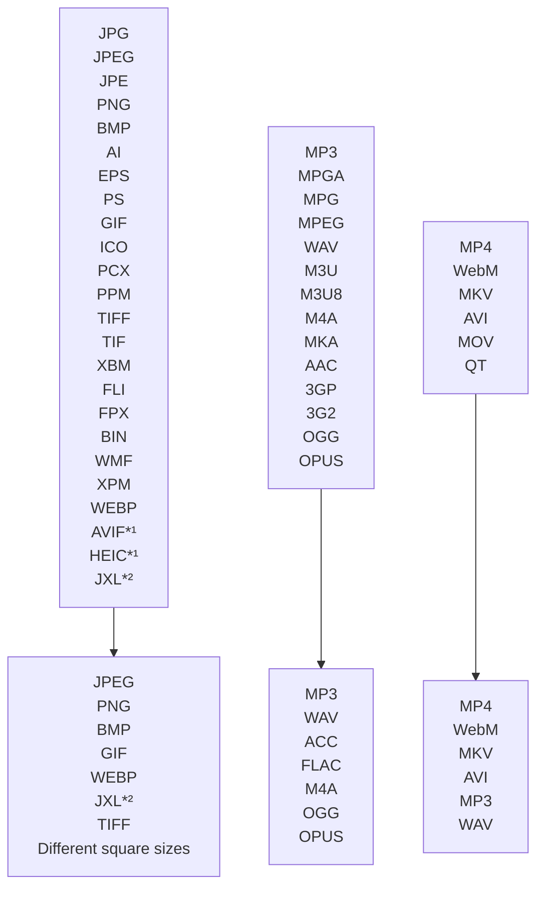

# nautilus-fileconverter-43
[](https://www.gnome-look.org/s/Gnome/p/1965601)

A python script to extend Nautilus using nautilus-python.

 

## 0. ReadMe Contents
1. [Features](#1-features)
2. [Installation](#2-installation)
   1. [Install dependencies](#21-install-dependencies)
   2. [Optional dependencies](#22-optional-dependencies)
   3. [Install the extension](#23-install-the-extension)
3. [Configuration](#3-configuration)
   1. [Automatic updates](#31-automatic-updates)
   2. [Manual update trigger](#32-manual-update-trigger)
   3. [Shown menu items](#33-shown-menu-items)
   4. [Patch note popup](#34-patch-note-popup)
4. [Updating](#4-updating)
5. [Usage](#5-usage)
6. [Any questions?](#6-any-questions)
7. [Credits](#7-credits)

# 1. Features
This programm can convert images, audio files and videos with the help of the default context menu in Nautilus. It works with a single Python script and has few depnendncy programms. It should work with every version of nautilus.

*¹ [Needs pyheif](#pyheif-heic-avif).
<br/>*² [Needs jxlpy](#jxlpy-jxl).
# 2. Installation
## 2.1 Install dependencies
The extension has a few dependencies which have to be installed.
###
[nautilus-python](https://github.com/GNOME/nautilus-python) needs to be installed to install extensions:

```bash
   Debian based distros:
  sudo apt install python3-nautilus

  Fedora based distros:
  sudo dnf install nautilus-python

  Arch based distros:
  sudo pacman -Sy python-nautilus
```
###


[pip](https://pypi.org/project/pip/) is a pre-dependency for pillow, it can be installed with the following commands:

```bash
   Debian based distros:
  sudo apt install python3-pip

  Fedora based distros:
  sudo dnf install python3-pip

  Arch based distros:
  pacman -S python-pip
```

[python-pillow](https://python-pillow.org/) is needed to convert images. It can be installed using pip:
```bash
    pip install Pillow
```
###

[ffmpeg](https://ffmpeg.org/download.html#build-linux) is needed to convert audio and video.

```bash
   Debian based distros:
  sudo apt install ffmpeg

  Fedora based distros:
  sudo dnf install ffmpeg

  Arch based distros:
  sudo pacman -S ffmpeg
```

###
GNOME's file viewer [Nautilus](https://apps.gnome.org/en-GB/app/org.gnome.Nautilus/) should be installed, otehrwise it will be hard to install extension to it.

## 2.2 Optional dependencies
### pyheif (HEIC, AVIF)
[pyheif](https://pypi.org/project/pyheif/) is needed if you want to convert from **heif** or **avif** format.
<br/> Install it using this command:
```bash
    pip install pyheif
```

### jxlpy (JXL)
[jxlpy](https://github.com/olokelo/jxlpy) is needed if you want to convert from **jxl** format.
<br/> Install it using this command:
```bash
    pip install jxlpy
```
Note: jxlpy is in a very early state, you may have issues while installing it using pip.
You may need to [install it manually](https://github.com/olokelo/jxlpy#build-it-yourself).

## 2.3 Install the extension
- Download the nautilus-fileconverter.py file from the [release page](https://github.com/Lich-Corals/Nautilus-fileconverter-43/releases).
    - Git users can also get the repository with these commands[:](https://bit.ly/3BlS71b)
        ```bash
            git clone https://github.com/Lich-Corals/Nautilus-fileconverter-43

            cd ./Nautilus-fileconverter-43
        ```
- For a system-wide installation move the file to '/usr/share/nautilus-python/extensions/' using this command in the dictonary with the file:
    ```bash
        sudo mv nautilus-fileconverter.py /usr/share/nautilus-python/extensions/nautilus-fileconverter.py
    ```
  - For a user specific installation move the file to '~/.local/share/nautilus-python/extensions/' using this command in the dictonary with the file:
      ```bash
          mv nautilus-fileconverter.py ~/.local/share/nautilus-python/extensions/nautilus-fileconverter.py
      ```
- Now you only have to restart Nautilus using the following commands:
    ```bash
        #Quit nautilus
        nautilus -q

        #start it again, you can also use the normal launcher.
        nohup nautilus & disown
    ```
# 3. Configuration
The program can be configured using the  NFC43-Config.json file, which will be created in the installation dictionary when the script is executed for the first time.
Just modify the file, by changing the 'true' and 'false' values.
If the program is installed in a root location, then you need to change the configuration inside the script.
<b>Don't forget to save your changes, and restart nautilus after modifying the configuration!</b>
```bash
    #Quit nautilus
    nautilus -q

    #start it again, you can also use the normal launcher.
    nohup nautilus & disown
```
## 3.1 Automatic updates
Automatic updates are only working in the home dictionary. If you've installed the script at the system-wide location, you may turn off automatic updates.
<br/><br/>To <b>turn off automatic updates</b>, open the config file with a text editor and set the `automaticUpdates` variable to 'false'.

## 3.2 Manual update trigger
To <b>manually trigger a self-update</b>, just open the .py file with a text editor and change the value of the `converterVersion` variable.

## 3.3 Shown menu items
To turn off the <b>patch note button</b> in the context menu, open the config file with a text editor and set the `showPatchNoteButton` variable to 'false'.
<br/><br/>To turn off the <b>Configure NFC43 button</b> in the context menu, open the config file with a text editor and set the `showConfigHint` variable to 'false'.
<br/><br/>To turn off the '<b>convert to square</b>' option, open the config file with a text editor and set the `convertToSquares` variable to 'false'.
<br/><br/>To turn off the '<b>convert to wallpaper</b>' function, open the config file with a text editor and set the `convertToWallpapers` variable to 'false'.

## 3.4 Patch note pop-up
To turn off the <b>patch note pop-up</b>, open the config file with a text editor and set the `showPatchNotes` variable to 'false'.

# 4. Updating
If the script is installed in the home folder (~/.local/share/nautilus-python/extensions/), it will update automatically as long as the automatic updates aren't disabled.

If automatic updates are disabled or the script is installed in the root folder, you can run the installation commands again.
# 5. Usage

Just right click on an supported file and choose the "Convert to..." option. In this sub menu you can select any file type you want to convert to.

Converting a file can take some time. There is no indicator when the process is done.

If you experience any issues with the extension, please report it on the [issues](https://github.com/Lich-Corals/nautilus-fileconverter/issues) page.

# 6. Any questions?
If anything is not clear...
<br/>If you have a problem...
<br/>If you need a specific feature...
<br/>If any of your files is not supported...
<br/><b>...feel free to write a [GitHub issue](https://github.com/Lich-Corals/Nautilus-fileconverter-43/issues/new/choose)!</b>

# 7. Credits
## Authors

- [Linus Tibert](https://github.com/Lich-Corals)

## Pull requests

- [derVedro](https://github.com/derVedro)
