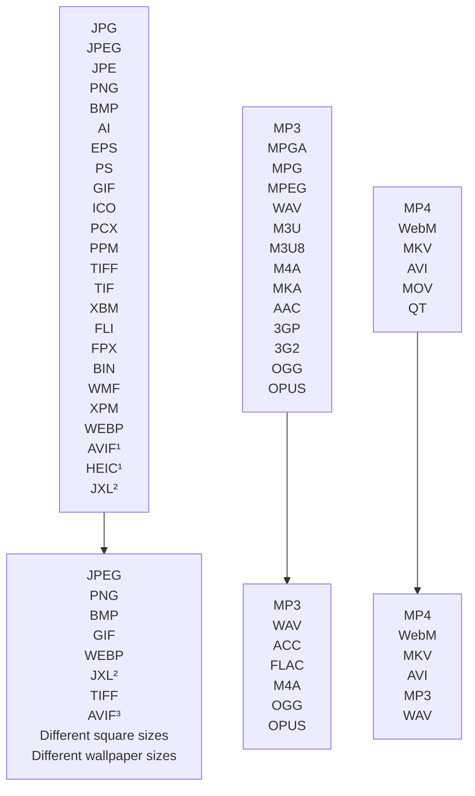

# linux-file-converter-addon

  

# Features
Convert between various image, audio and video formats using the context menu. The addon is written in Python and available for **Nautilus**, **Nemo**, **Thunar** and **Dolphin** file viewers. It adds a new option to the context menu to create an easy way to convert between a huge amount of file types.
The program offers many options to customize the appearance of its context menu. There are also a few extra formats which can be added by installing optional dependencies.
The tool has a built-in auto-update function to make sure the newest version is always installed.
 

    

¹ [Needs pyheif](https://github.com/Lich-Corals/linux-file-converter-addon/blob/main/markdown/install-dependencies.md#pyheif-heic-avif).
 ² [Needs jxlpy](https://github.com/Lich-Corals/linux-file-converter-addon/blob/main/markdown/install-dependencies.md#jxlpy-jxl).
 ³ [Needs pillow-avif-plugin](https://github.com/Lich-Corals/linux-file-converter-addon/blob/main/markdown/install-dependencies.md#pillow-avif-plugin-to-avif).

# Installation
You can follow the [TL;DR installation guide](https://github.com/Lich-Corals/linux-file-converter-addon/blob/main/markdown/tldr-installation.md) for a quick and painless installation...

Or you head over to the installation page for your file manager for the full installation experience:
- [Nautilus](https://github.com/Lich-Corals/linux-file-converter-addon/blob/main/markdown/install-nautilus.md)
- [Nemo](https://github.com/Lich-Corals/linux-file-converter-addon/blob/main/markdown/install-nemo.md)
- [Thunar](https://github.com/Lich-Corals/linux-file-converter-addon/blob/main/markdown/install-thunar.md)
- [Dolphin](https://github.com/Lich-Corals/linux-file-converter-addon/blob/main/markdown/install-dolphin.md)

# Updating
If the script is installed in the home folder or has permissions to write in its directory, it will update automatically as long as automatic updates aren't disabled.

If automatic updates are disabled, you can run the installation commands again to update the program.

# Usage
Just right-click on any supported file and choose the "Convert to..." option. In this sub menu you can select any file type you want to convert to.

> [!NOTE]   
> Converting a file can take some time. With the default settings, there will be a notification when all files are converted.

> [!IMPORTANT]  
> If you experience any issues with the extension, please report it on the [issues](https://github.com/Lich-Corals/linux-file-converter-addon/issues) page.

# Contributing
Contributions are always welcome!
If you want to contribute to this project, take a look at the [open issues](https://github.com/Lich-Corals/linux-file-converter-addon/issues?q=is%3Aissue%20state%3Aopen%20) and at [issues with help-wanted tag](https://github.com/Lich-Corals/linux-file-converter-addon/issues?q=is%3Aissue%20state%3Aopen%20label%3A%22help%20wanted%22) or propose other edits to the program using a pull-request.
The code of the project is partly commented and relatively self explaining. If you're curious about the way something is accomplished in the code, you can always ask about it in an issue and if you think there is a better way to do it, you're welcome to edit the code or share your ideas in another issue.

# Any questions?
If anything is not clear...
 If you have a problem...
 If you need a specific feature...
 If any of your files are not supported...
 <b>Check if anyone had the same issue before [on this page](https://github.com/Lich-Corals/linux-file-converter-addon/issues?q=) or feel free to open a new [GitHub issue](https://github.com/Lich-Corals/linux-file-converter-addon/issues/new/choose)!</b>

# Credits
- [Linus Tibert](https://github.com/Lich-Corals)
   Maintenance, issues, support
- [derVedro](https://github.com/derVedro)
   Pull requests, issue solving
- [D10f](https://github.com/D10f)
   Pull requests

#### All sections
- __[Main page](https://github.com/Lich-Corals/linux-file-converter-addon/blob/main/README.md)__
- [Configuration](https://github.com/Lich-Corals/linux-file-converter-addon/blob/main/markdown/configuration.md)
- [Errorrs and warnings](https://github.com/Lich-Corals/linux-file-converter-addon/blob/main/markdown/errors-and-warnings.md)
- [TL;DR installation guide](https://github.com/Lich-Corals/linux-file-converter-addon/blob/main/markdown/tldr-installation.md)
- [Install dependencies](https://github.com/Lich-Corals/linux-file-converter-addon/blob/main/markdown/install-dependencies.md)
- [Installation for Nautilus](https://github.com/Lich-Corals/linux-file-converter-addon/blob/main/markdown/install-nautilus.md)
- [Installation for Nemo](https://github.com/Lich-Corals/linux-file-converter-addon/blob/main/markdown/install-nemo.md)
- [Installation for Thunar](https://github.com/Lich-Corals/linux-file-converter-addon/blob/main/markdown/install-thunar.md)
- [Installation for Dolphin](https://github.com/Lich-Corals/linux-file-converter-addon/blob/main/markdown/install-dolphin.md)
