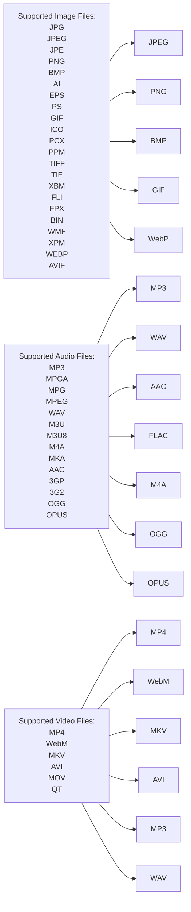

# nautilus-fileconverter
[](https://www.gnome-look.org/s/Gnome/p/1965601)

A python script to extend Nautilus using nautilus-python.


## Features
This programm can convert images, audio files and videos with the help of the default context menu in Nautilus. It works with a single Python script and has few depnendncy programms. It should work with every version of nautilus.


### Supported image types (convert to)
    - JPEG
    - PNG
    - BMP
    - GIF
    - WebP
### Supported audio types (convert to)
    - MP3
    - WAV
    - AAC
    - FLAC
    - M4A
    - OGG
    - OPUS
### Supported video types (convert to)
    - MP4
    - WebM
    - MKV
    - AVI
    - MP3
    - WAV
## Install dependencies
The extension has a few dependencies which have to be installed.
###
[nautilus-python](https://github.com/GNOME/nautilus-python) needs to be installed to install extensions:

```bash
   Debian based distros:
    sudo apt install python3-nautilus

   Fedora based distros:
    sudo dnf install nautilus-python

   Arch based distros:
    sudo pacman -Sy python-nautilus
```
###


[pip](https://pypi.org/project/pip/) is a pre-dependency for pillow, it can be installed with the following commands:

```bash
   Debian based distros:
    sudo apt install python3-pip

   Fedora based distros:
    sudo dnf install python3-pip

   Arch based distros:
    pacman -S python-pip
```

[python-pillow](https://python-pillow.org/) is needed to convert images. It can be installed using pip:
```bash
    pip install Pillow
```
###

[ffmpeg](https://ffmpeg.org/download.html#build-linux) is needed to convert audio and video.

```bash
   Debian based distros:
    sudo apt install ffmpeg

   Fedora based distros:
    sudo dnf install ffmpeg

   Arch based distros:
    sudo pacman -S ffmpeg
```
###
GNOME's file viewer [Nautilus](https://apps.gnome.org/en-GB/app/org.gnome.Nautilus/) should be installed, otehrwise it will be hard to install extension to it. 
###
note: The extension is only tested on Fedora Linux 37 (Workstation Edition). I can't guarantee that it's working for everyone.
## Install the extension
- Download the nautilus-fileconverter.py file from the [release page](https://github.com/Lich-Corals/Nautilus-fileconverter-43/releases).
    - Git users can also get the repository with these commands:
        ```bash
            git clone https://github.com/Lich-Corals/Nautilus-fileconverter-43
            
            cd ./Nautilus-fileconverter-43
        ```
- For a systemwide installation move the file to '/usr/share/nautilus-python/extensions/' using this command in the dictonary with the file:
    ```bash
        sudo mv nautilus-fileconverter.py /usr/share/nautilus-python/extensions/nautilus-fileconverter.py
    ```
- For a user spesific installation move the file to '~/.local/share/nautilus-python/extensions/' using this command in the dictonary with the file:
    ```bash
        mv nautilus-fileconverter.py ~/.local/share/nautilus-python/extensions/nautilus-fileconverter.py
    ```
- Now you only have to restart Nautilus using the following commands:
    ```bash
        nautilus -q 

        nohup nautilus & disown
    ```
## Usage

Just right click on an supported file and choose the "Convert to..." option. In this sub menu you can select any file type you want to convert to.

Converting a file can take some time. There is no indicator when the process is done.

If you experience any issues with the extension, please report it on the [issues](https://github.com/Lich-Corals/nautilus-fileconverter/issues) page.

## Authors

- [Linus Tibert](https://github.com/Lich-Corals)

## Pull requests

- [derVedro](https://github.com/derVedro)
